##### 我们的品牌

#### ccbpm系统概要介绍 
- 技术交流群:1060674395, 在右上角点:watch,star,fork支持我们,谢谢.
- 驰骋工作流引擎研发与2003年，具有.net与java两个版本，这两个版本代码结构，数据库结构，设计思想，功能组成， 操作手册，完全相同。 导入导出的流程模版，表单模版两个版本完全通用。
- 我们把驰骋工作流程引擎简称ccbpm, CCFlow是.net版本的简称，JFlow是java版本的简称，我们未来将要发布python版本的PFlow,敬请关注.
- 十多年来，我们一直践行自己的诺言，真心服务中国IT产业，努力提高产品质量，成为了国内知名的老牌工作流引擎。
- ccbpm作简单、概念通俗易懂、操作手册完善（计:14万操作手册说明书）、代码注释完整、案例丰富翔实、单元测试完整。
- ccbpm包含表单引擎与流程引擎两大部分，并且两块完美结合，流程引擎对表单引擎的操纵，协同高效工作, 完成了很多国内生产审批模式下的流程设计,
- ccbpm的流程与表单界面可视化的设计，可配置程度高，采用结构化的表单模版设计,集中解析模式的设计. 适应于中国国情的多种场景的需要、配置所见即所得、低代码、高配置.
- ccbpm 在国内拥有最广泛的研究群体与应用客户群，是大型集团企业IT部门、软件公司、研究院、高校研究与应用的产品。
- ccbpm不仅仅能够满足中小企业的需要，也能满足通信级用户的应用，先后在西门子、海南航空、中船、陕汽重卡、华电国际、江苏山东吉林测绘院、厦门证券、天业集团、天津港等国内外大型企业政府单位服役。
- ccbpm可以独立运行，也可以作为中间件嵌入您的开发架构,还可以作为服务的模式支持对外发布.
- ccbpm 既有配置类型的开发适用于业务人员，IT维护人员， 也有面向程序员的高级引擎API开发,满足不同层次的流程设计人员需要.
- 支持 oracle,sqlserver,mysql 数据库. 内置:
- 流程引擎设计支持所见即所得的设计：节点设计、表单设计、单据设计、报表定义设计、以及用户菜单设计。
- 流程模式简洁，只有4种容易理解：线性流程、同表单分合流、异表单分合流、父子流程，没有复杂的概念。
- 配置参数丰富，支持流程的基础功能：前进、后退、转向、转发、撤销、抄送、挂起、草稿、任务池共享，也支持高级功能取回审批、项目组、外部用户等等。
- 数据库脚本可以用代码自动安装完成。只需要新建一个空的数据库，运行项目后访问流程设计器页面，即可进入脚本自动安装的页面。  

##### 生态伙伴-排名不分先后.
- 微同商城 https://gitee.com/fuyang_lipengjun/platform
- 单点登录 https://gitee.com/dotnetchina/BootstrapAdmin
- Bootstrap Blazor https://gitee.com/dotnetchina/BootstrapAdmin 
- ccflow 项目已加入 [dotNET China](https://gitee.com/dotnetchina) 组织.

### 资源
0. http://demo.ccflow.org 在线演示.
1. http://ccflow.org 官方网站
2. https://ccfast.cc  驰骋低代码开发平台
3. http://doc.ccbbpm.cn  操作手册
4. http://ccflow.org/ke.htm 视频教程

## 后台设计器
 - 登录主页 

- 流程列表
 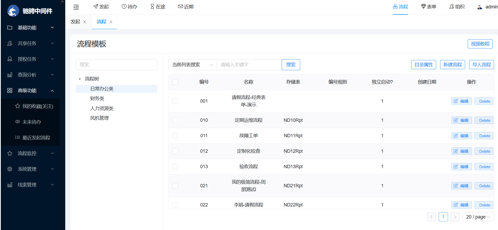
- 流程设计器
 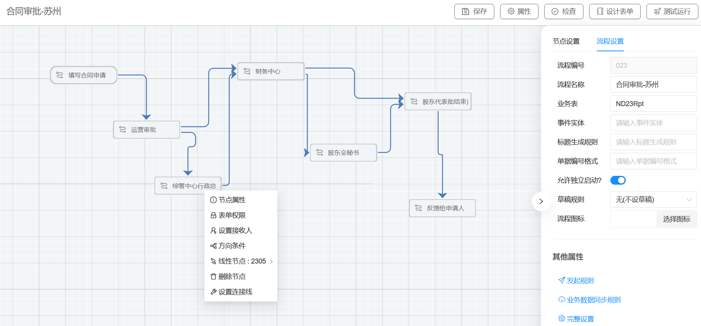
- 表单列表
 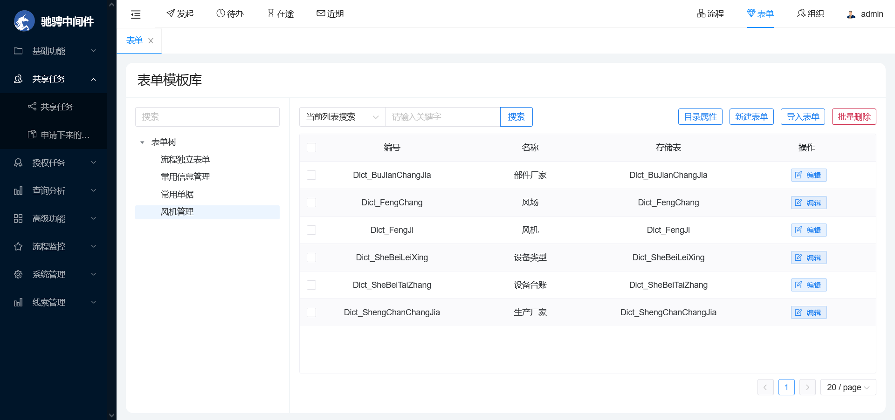
- 表单设计器
 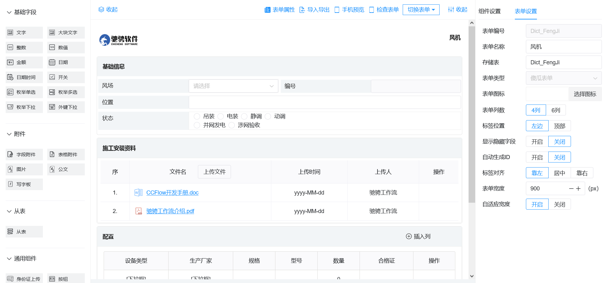
## 组织结构
 - 组织结构
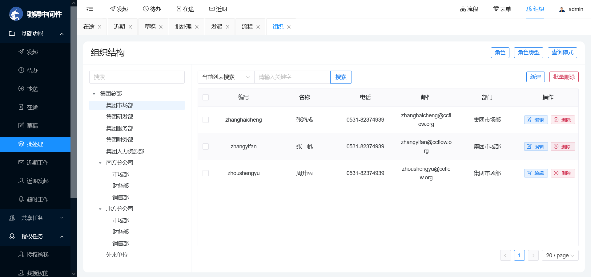
  - 角色 
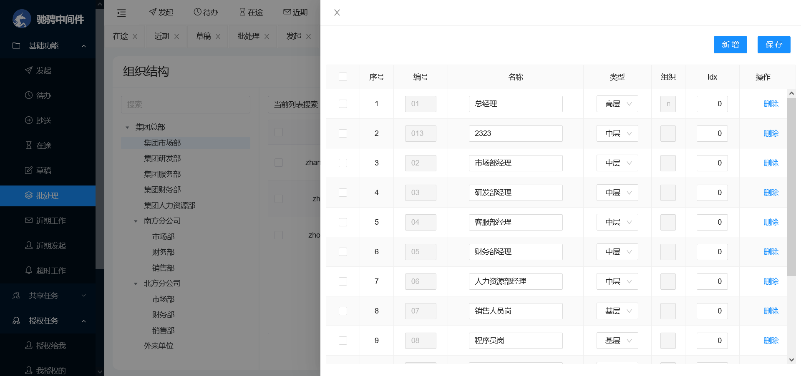
  - 人员
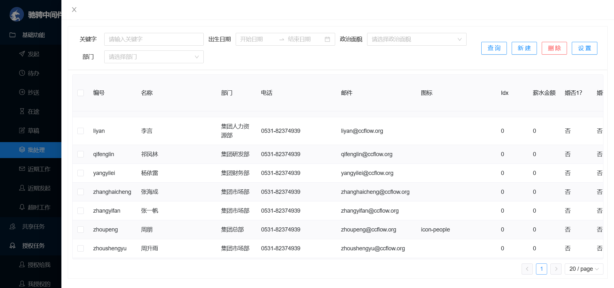

## 前端应用
- 发起 
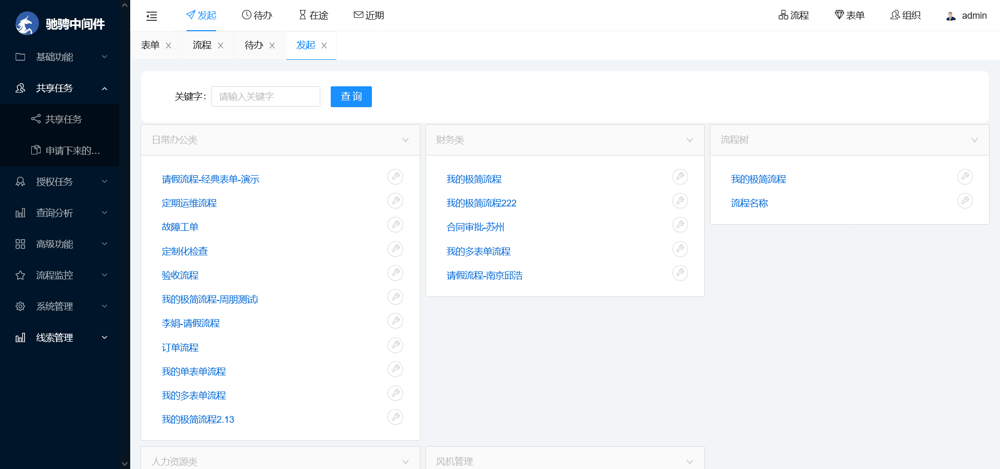
- 待办
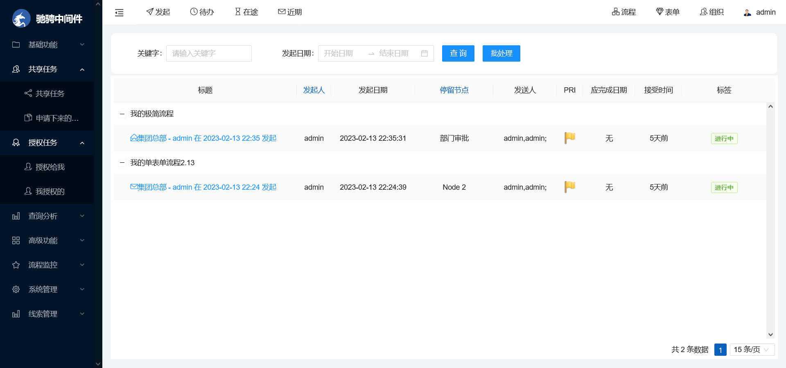
- 在途
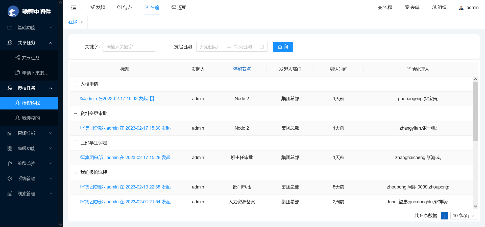
- 近期
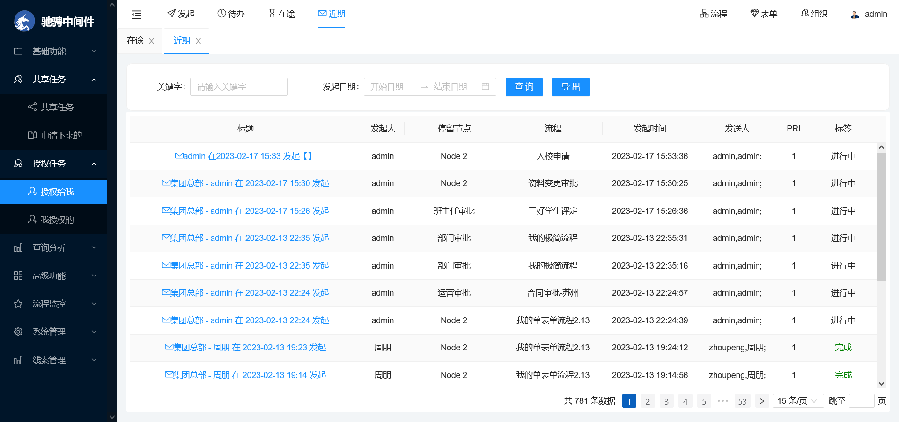

###  H5版本
- 流程图1

-  **流程图2** 

**流程图3**

**丰富节点属性配置项**

**丰富流程属性配置项**

**开发者表单设计器** 

### 前端流程处理

**流程发起**

**待办**

**工作处理1**

**工作处理2**

**工作处理3**

**查询**

### 版本说明 ### 
1. 主版本 ccflow，.Net Framework 4.5.2，Visual Studio 2017/2019，本项目，分支为 [develop](https://gitee.com/opencc/ccflow/tree/develop/)
2. 旧版，For Vs2010，.Net Framework 4.0，Visual Studio 2010，本项目，分支为 [forVS2010](https://gitee.com/opencc/ccflow/tree/forVS2010/)
3. .NetCore版，.Net Core 3.0 Preview 5，Visual Studio 2019，参见另一个项目 [CCFlowForNetcore](https://gitee.com/opencc/CCFlowForNetcore) 
4. Java版，参见另一个项目 [JFlow](https://gitee.com/opencc/JFlow) 

### 组成部分
1. 驰骋工作流程引擎 JFlow
2. 驰骋表单引擎. CCForm
3. 组织结构管理, 菜单权限管理. GPM

### 为什么选择ccflow? ###
01. CCFlow成长于中国2003年,历史长久,在多种生产、管理环境中成长起来，是国内老牌的工作流程引擎,拥有众多的爱好者,开发者, 100%的核心代码开源.
02. 历经多个项目多种行业磨练(请参考官方网站成功案例),规则丰富，生命力强，绝大多数应用可以实现无代码流程设计.
03. CCFlow的核心代码都是公司自己研发的，核心算法也是基于实际应用，经过我们十多年的发展，每个所服务的客户都能得到最佳的流程解决方案.
04. CCFlow没有借助第3方的流程软件,拥有独立知识产权, 所以我们最容易扩展,实现客户的需求.
06. CCFlow功能强大,可配置性好，通常的应用开发可以实现无代码实现,面向业务人员、系统管理员、与程序员.
07. 使用开源的软件好处众多,可以跟踪调试,可以修改，研究者众多，容易得到帮助,可以与我们的开发人员在线互动,遇到问题可以在第1时间解决.
08. CCFlow是国内第一款同时拥有.net版本与java版本的工作流引擎,两者互为影子版本,数据库解构,配置界面完全相同.
09. CCFlow设计思路精巧、概念简单.只有线性、同表单分合流、异表单分合流、父子流程四个概念. 有涵盖多种行为的5*5的算法，流程模式实现现实生活中绝大多数模式(目前没有我们解决不了的问题).
10. CCFlow的概念简洁、通俗易懂, 运行规则与运行模式清晰，数据库结构设计精简,规则丰富，帮助详实.
11. CCFlow是国内流程引擎与表单引擎集成较好的bpm软件,流程引擎可以操纵表单引擎数据实现复杂的业务数据处理与权限控制.
12. CCFlow拥有200多个流程演示模版,涵盖了我们在开发过程中遇到的很多的应用场景,参考这些模版,容易获得帮助.
13. CCFlow拥有40多个单元测试案例，这些单元测试案例，是保障ccflow稳定运行的基础,在核心代码修改后容易找打问题.
14. CCFlow资料完善（约:16万字)，拥有众多的爱好者,开发者容易得到帮助. CCFlow的代码放在Git上，容易修改代码与我们合并.
15. CCFlow集成方便, 概念、名词通俗易懂.

### 基础功能 ###
1. 流程引擎设计支持所见即所得的设计：节点设计、表单设计、单据设计、报表定义设计，方向条件设计....
2. 流程模式简洁只有4种容易理解、线性流程、同表单分合流、异表单分合流、父子流程，没有复杂的概念。
3. 支持流程的基础功能：前进、后退、转向、转发、撤销、抄送、挂起、草稿、任务池共享，也支持高级功能取回审批、项目组、来宾用户等等。
4. 支持sdk开发，多表单展现，字段权限控制，从表控制，多种符合中国国情的业务规则设置.
5. 表单引擎与流程引擎可以分开也可以单独使用，流程引擎可以驱动表单引擎，实现多种业务数据的操作，比如：汇总、分合、填写.
6. CCFlow 集成方式简洁，容易实现插件模式的开发.
7. SDK 接口丰富，注释详细, [丰富的帮助文档](http://ccflow.org/CCBPMFile/default.htm "到达帮助文档."),  容易上手.
8. 更多的功能请参考官方网站.

### ccflow 程序文件清单:  ###
1. D:\ccflow\Components   -- 组件目录.
2. D:\ccflow\Components\BP.En30   -- 底层基类.
3. D:\ccflow\Components\BP.WF  --工作流程引擎层
4. D:\ccflow\RefDLL  -- 第三方组件中需要调用dll. 大部分关键组件用nuget管理
5. D:\ccflow\Documents -  文档
6. D:\ccflow\CCFlow  -- BS工作流程引擎前台.  
7. D:\ccflow\DemoAndTesting  - 单元测试&Demo

### ccflow前台目录结构.前台程序.(不建议用户修改，如果修改请提交给我们，否则您就没有办法升级.) ###
01. D:\ccflow\CCFlow\WF\ --前台程序.
02. D:\ccflow\CCFlow\WF\Comm  --通用功能层.
03. D:\ccflow\CCFlow\WF\Data  -- 应用程序数据目录. 包含一些xml,等等。
04. D:\ccflow\CCFlow\WF\Data\Install 与安装有关系的文件
05. D:\ccflow\CCFlow\WF\Data\JSLib  系统javascript 函数库。
06. D:\ccflow\CCFlow\WF\Data\Language 语言包(完善中)
07. D:\ccflow\CCFlow\WF\Data\Node  cs流程设计器节点类型（cs流程设计器不在发展）
08. D:\ccflow\CCFlow\WF\Data\XML  xml配置文件不仅仅ccflow使用,bp框架也使用它。
09. D:\ccflow\CCFlow\WF\UC  --用户控件.
10. D:\ccflow\CCFlow\WF\DocFlow -- 公文流程(目前还不是很完善)
11. D:\ccflow\CCFlow\WF\Admin - 对ccflow的管理比如设计方向条件.报表定义...
12. D:\ccflow\CCFlow\WF\SDKComponents  --流程组件目录.
13. D:\ccflow\CCFlow\WF\WorkOpt -- 工作处理器的附件功能.
14. D:\ccflow\CCFlow\WF\Admin\CCBPMDesigner -- H5的流程设计器.
15. D:\ccflow\CCFlow\WF\Admin\CCFormDesigner -- H5的表单设计器.
16. D:\ccflow\CCFlow\SDKFlowDemo -- sdk开发模式的案例.

### 1.2 前台的用户数据文件，用户可以更改. ###
01. D:\ccflow\CCFlow\DataUser --用户文件.
02. D:\ccflow\CCFlow\DataUser\Seal -- 电子盖章图片.
03. D:\ccflow\CCFlow\DataUser\UploadFile - 上传附件
04. D:\ccflow\CCFlow\DataUser\Style -- 个性化风格文件.
05. D:\ccflow\CCFlow\DataUser\CyclostyleFile -- 单据模版文件.
06. D:\ccflow\CCFlow\DataUser\EmailTemplete -邮件模版文件.
07. D:\ccflow\CCFlow\DataUser\ICON --ICON
08. D:\ccflow\CCFlow\DataUser\TaoHong --公文套红.
09. D:\ccflow\CCFlow\DataUser\Bill  单据打印生成数据.
10. D:\ccflow\CCFlow\DataUser\CyclostyleFile 单据模板数据
11. D:\ccflow\CCFlow\DataUser\DtlTemplete  导入明细表模板文件.
12. D:\ccflow\CCFlow\DataUser\EmailTemplete  自定义邮件发送格式文件.
13. D:\ccflow\CCFlow\DataUser\JSLib 用户自定义函数库
14. D:\ccflow\CCFlow\DataUser\JSLibData 用户自定义函数生成文件。
15. D:\ccflow\CCFlow\DataUser\Log 系统日志文件
16. D:\ccflow\CCFlow\DataUser\ReturnLog 退回日志文件.
17. D:\ccflow\CCFlow\DataUser\Siganture 签名文件.
18. D:\ccflow\CCFlow\DataUser\Style 用户自定义风格文件。
19. D:\ccflow\CCFlow\DataUser\UploadFile 表单附件上传文件，单附件，与多附件。
20. D:\ccflow\CCFlow\DataUser\XML 用户系统配置文件。

